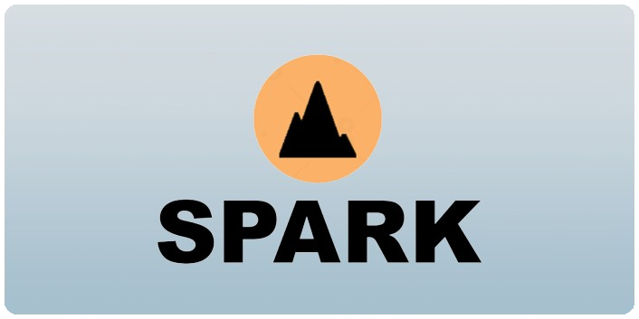

# SPARK

SPARK is a general purpose game engine written in C++.

It is designed to be used during my 3 yers of studies at Ynov Bordeaux.

## Features
The engine is currently capable of rendering a simple 2D scene and can be used to create simple games like pong.

This engine will evolve during the next years. The following features are planned:
- 2D and 3D rendering (using Vulkan)
- Physics simulation
- Audio
- Editor

## Testing the engine
You have the following examples to try the engine:
- `pong` (Windows/Linux) A simple pong game

## Contributing

Feel free to contribute to this project by forking it and submitting a pull request. You can also open an issue if you find a bug or have a suggestion.

### Building the engine
To build the engine, you will need to install the following dependencies:
- [CMake](https://cmake.org/download/) (>= 3.25)
- [VCPKG](https://vcpkg.io/en/getting-started.html) with executable in PATH
- A C++ compiler (MSVC (>=19.31), GCC (>=13.1)) or Clang (>=16.0.0)

You have the following CMake presets to build the engine:

<u>Configuration presets:</u>
- `dev_vc143`, (Windows) using Visual Studio 2022 generator and MSVC compiler
- `dev_vc143_ninja` (Windows) using Ninja generator and MSVC compiler
- `dev_clang_ninja` (Windows & Linux) using Ninja generator and Clang compiler
- `dev_gcc_ninja` (Linux) using Ninja generator and GCC compiler

<u>Build presets:</u>  
A build preset is composed of a configuration preset and a build type (`debug` or `release`) .  
For example, `dev_vc143_debug` is a build configured from `dev_vc143` in debug mode.

<u>Test presets:</u>  
A test preset is of the same form as a build preset, but launched with CTest.

## License
This project is licensed under the MIT License - see the [LICENSE](https://github.com/Tractorou24/spark/blob/main/LICENSE) file for details.
